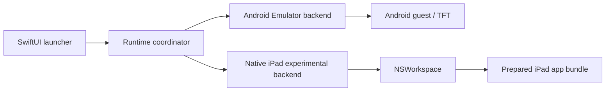

# Native iPad Runtime proof of concept

## Goal and scope

Mactician includes an experimental, feature-gated backend that can validate and
launch an existing prepared iPad application bundle on Apple Silicon. It is a
parallel proof of concept: Android Emulator remains the default and its install,
launch, repair, reset, update, hotkey, and AVD paths remain independent.

The native backend accepts only a user-selected `.app` bundle. Mactician does
not acquire or process IPA files, extract or decrypt applications, change code
signatures or entitlements, remove quarantine, bypass DRM or anti-cheat, or
modify the application bundle or its container. It does not verify that a
selected application is an authentic Riot client. A production TFT bundle
identifier allow-list has not been confirmed.

## Architecture



`LauncherModel` owns runtime selection and the existing UI state machine.
`AndroidRuntimeControllerAdapter` forwards the existing Android configuration
and events to `RuntimeController`; it does not alter Android installation.
`NativeIPadRuntimeController` uses an injected `WorkspaceApplicationLaunching`
adapter for launch, exact-process tracking, notifications, and termination.
Only one managed backend can be active, and runtime selection is locked while
the state machine is launching, playing, or stopping.

## Feature gate and selection

The experimental UI is available in a `DEBUG` build or when either the fixed
`MACTICIAN_ENABLE_NATIVE_IPAD_RUNTIME=1` environment variable or the internal
`experimental.nativeIPadRuntime.enabled` defaults key enables it. Tests inject
all gate inputs. Without the gate, a production build restores Android even if
a native selection was previously saved, so existing users retain the current
UI and default behavior.

The Experimental settings section uses `NSOpenPanel` configured for one
application bundle. It does not accept IPA, ZIP, DMG, executable files, or
ordinary directories and does not scan the disk or PlayCover data.

## Validation

Validation runs before state is saved and again before every launch. It:

- requires an arm64 host and an existing canonical `.app` directory;
- resolves top-level symlinks and rejects Mactician or a bundle inside it;
- parses `Info.plist` in a supported bundle layout, the bundle identifier,
  executable name, package type, declared iPad device family, and optional
  version/build metadata;
- requires a regular executable containing an arm64 slice, inspected with the
  fixed `/usr/bin/lipo` executable and argument array without a shell;
- verifies the complete code signature through Security framework strict,
  nested-code, and all-architecture validation;
- classifies valid ad-hoc, Developer ID, App Store, Apple Development, and other
  signatures for local diagnostics without changing them.

These checks establish local structure and signature integrity. They do not
establish application provenance, Riot support, account safety, login behavior,
or gameplay compatibility.

The validator accepts both the conventional macOS `Contents` layout and the
iOS-style root bundle layout exposed by some system-installed iPad apps.

## State storage

Native state is separate from Android state:

```text
~/Library/Application Support/Mactician/
    install-state.json
    native-ipad/
        native-ipad-state.json
```

The native JSON contains schema version 1, a bookmark, validated metadata, the
last successful validation time, an optional local error, and a source kind.
Writes are atomic. Unknown schemas, corrupt JSON, stale bookmarks, moved paths,
and deleted bundles fail closed and require another selection. Forget removes
only `native-ipad-state.json`; it never removes the external application,
container, Keychain items, login state, game data, AVD, or Android install state.

## Process lifecycle

Launch uses `NSWorkspace.openApplication` with activation enabled. If the exact
bundle identifier and canonical bundle URL are already running, Mactician
activates and attaches to that process instead of opening a second instance.
Otherwise it stores the exact `NSRunningApplication`, PID, and canonical URL
returned for the selected bundle. A live process changes the launcher state
from launching to playing; this means only that the process is running, not that
the lobby or a match loaded.

Termination notifications are matched by PID and canonical bundle URL and are
deduplicated. Stop first requests `terminate()`, waits for a bounded interval,
and may call `forceTerminate()` only on the same tracked object. Application
shutdown terminates only a process launched by the current Mactician session;
an attached pre-existing process is left running.

## Android fallback and services

Native mode does not start ADB, the emulator, AVD configuration, APK updates,
Android overlays, input hotkeys, Accessibility prompts, login repaint repair,
audio recovery, FPS overlay, graphics profiles, language overrides, resource
tuning, or Android game update checks. Android-only controls are absent from
the native UI. Switching back restores the existing Android readiness state;
native selection and validation never mutate Android installation data.

## Privacy and security boundaries

Native sessions do not enter the existing Android session telemetry payloads
and are not disguised as Android. No path, bundle identifier, signature
identity, Team ID, PlayCover status, account, container metadata, or native
probe error is sent. The backend does not read Riot credentials, Keychain data,
login URLs, application containers, or environment dumps.

PlayCover may have been used externally to prepare an application, but Mactician
has no PlayCover code, package, binary, build dependency, private symbol, URL
scheme, container assumption, download flow, or IPA-library integration.

## Known limitations and production gate

No prepared TFT application was supplied for this implementation, so real Riot
login, rendering, lobby, match, persistence, performance, and compatibility are
not validated. This backend must remain experimental until a lawful test bundle
passes a complete manual session and repeat launch, a precise TFT identifier
allow-list and compatibility policy are approved, failure diagnostics are
reviewed on supported macOS versions, and Android fallback remains verified.

## Manual validation when a real bundle is available

Enable the local feature gate, select the bundle through Mactician, confirm the
displayed metadata, and launch it. Verify the exact process and window, enter
credentials manually, then check login rendering, lobby, match start, one full
match, Stop, relaunch, and login persistence. Finally switch to Android and
repeat the ordinary Android launch and Stop flow. Do not automate credentials,
inspect private network traffic, patch the application, or continue past a
signature, entitlement, DRM, login, anti-cheat, integrity, or crash failure.
